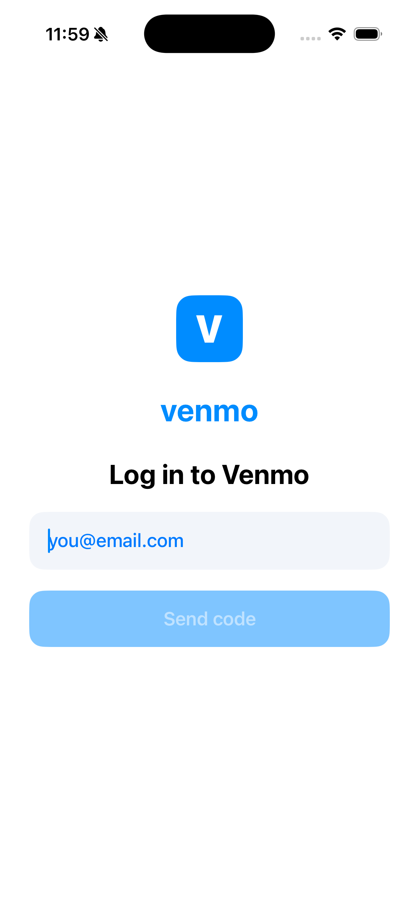

<div align="center">

# Stable Venmo

**A Venmo-style stablecoin wallet for iOS — gasless USDC payments via native EIP-7702, built on the [Openfort](https://www.openfort.io) Swift SDK.**



</div>

## What it is

A native SwiftUI iOS app that looks and feels like Venmo, but moves **USDC on Base Sepolia** through an Openfort embedded wallet. Email-OTP login, an embedded wallet created on device, a live balance, a social payment feed, and **gasless payments** — the user never holds ETH or signs a gas prompt.

Payments use **EIP-7702**: the embedded EOA is delegated to a smart-account implementation and the user operation is sponsored by an Openfort gas policy, so the recipient gets the full amount.

This is a fork of [stable-cashapp](https://github.com/joalavedra/stable-cashapp) — the same wallet internals, reskinned and restructured around Venmo's feed-first, note-driven experience.

## Features

- 📧 **Email-OTP sign-in** — no passwords, no seed phrases
- 👛 **Embedded wallet** — created/recovered on device (password recovery in the Keychain)
- ⚡ **Gasless EIP-7702 payments** — one-time authorization signed natively by the embedded signer (no key export), sponsored via Openfort's bundler + paymaster
- 🧾 **Social feed** — on-chain `Transfer` history rendered as Venmo-style "you paid / paid you" entries with notes
- 📝 **Notes on payments** — the "What's it for?" memo, kept locally (ERC-20 has no memo field) and shown back in the feed
- 💵 **Live USDC balance** + the signature **Pay or Request** flow, QR receive, profile, key export

## Architecture

| Layer | What |
|---|---|
| `App/Wallet/OpenfortClient.swift` | Thin async wrapper over `OFSDK` — readiness gate, email OTP, wallet configure, gasless `sendUSDC` |
| `App/Wallet/WalletStore.swift` | `ObservableObject` driven by the SDK's embedded-state events |
| `App/Wallet/EVM.swift` | ERC-20 calldata + JSON-RPC reads (balance, code, transfer history) |
| `App/Views/*` | The Venmo UI (feed home + bottom nav, pay/request composer, receive, profile, auth) |

The `App/Wallet/*` layer is unchanged from the Cash App build — only the design layer (`Theme.swift`, `App/Views/*`) was rewritten. Built on the [Openfort Swift SDK](https://github.com/openfort-xyz/swift-sdk) (v2.0.0), which provides native EIP-7702 gasless sends and dependency-free ERC-20 helpers.

## Build & run

Requires Xcode 26+, [`xcodegen`](https://github.com/yonaskolb/XcodeGen) (`brew install xcodegen`).

```bash
xcodegen generate
open OpenfortVenmo.xcodeproj   # then Run, or:

xcodebuild build -project OpenfortVenmo.xcodeproj -scheme OpenfortVenmo \
  -destination 'platform=iOS Simulator,name=iPhone 17' -derivedDataPath build
```

> The app must be **signed** (it ships a `keychain-access-groups` entitlement and signs ad-hoc) — the SDK stores session state in the Keychain. To try a real payment, fund the EOA address shown under **Me** with [Base Sepolia USDC](https://faucet.circle.com/).

## Notes

This is a **testnet demo**. `App/Resources/OFConfig.plist` contains *publishable* Openfort keys (client-safe, no secrets). Not production-hardened — recovery is single-device and keys are bundled for convenience.

## License

[MIT](./LICENSE)
